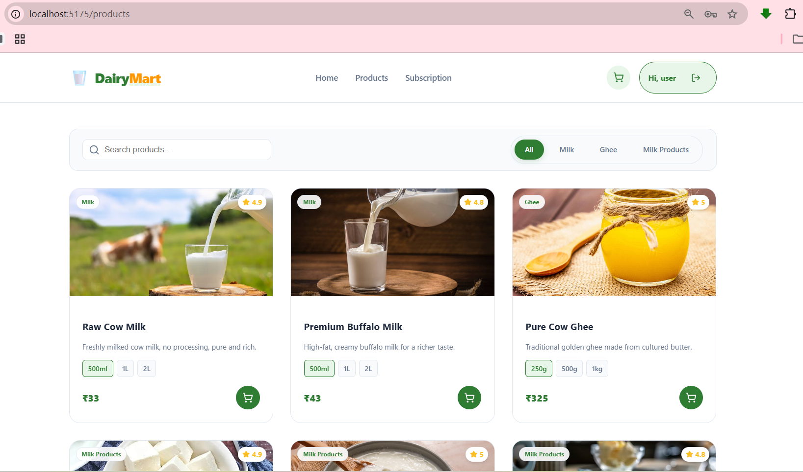

# 🥛 DairyMart: Freshness Delivered to Your Doorstep

Welcome to **DairyMart**! This project is all about bringing the farm-fresh experience right to your kitchen. We’ve built a simple, beautiful, and reliable way for families to get their daily dose of pure milk, ghee, and more without any hassle.

Whether you're looking for a one-time purchase or a recurring subscription that "just works" every morning, DairyMart has you covered.

---

## 🌟 What makes DairyMart special?

*   **Freshness First**: Everything you see—from raw cow milk to artisan paneer—is sourced directly from our healthy farm cows. No middlemen, no compromise.
*   **Smart Subscriptions**: Busy life? Just set up a plan (like our "Daily Fresh" or "Family Pack"), and we’ll handle the rest. You can pause or resume whenever you're away.
*   **Real-time Pricing**: Want 500ml or 2L? The price updates instantly so you know exactly what you're paying for.
*   **Admin Power**: We’ve built a dedicated Staff Portal for our milkmen and managers to keep track of orders, update stock, and manage users easily.
*   **Smooth & Animated**: We believe a website should feel alive. You'll notice smooth entrance animations and hover effects that make browsing a joy.

---

## 🛠️ How we built it

We used a modern tech stack to keep things fast and reliable:
*   **Frontend**: React (Vite) for a snappy, interactive UI.
*   **Backend**: Django & Django Rest Framework (DRF) to handle all the heavy lifting and data.
*   **Icons & Style**: Lucide React for clean icons and custom CSS for that premium look.

---

## 🚀 Getting it running on your machine

### 1. Grab the code
```bash
git clone <your-repo-link>
cd "MilkMan Django Project"
```

### 2. Start the Backend (The Brain)
```bash
cd backend
# Setup your environment
python -m venv venv
.\venv\Scripts\Activate.ps1
# Install & Run
pip install -r requirements.txt
python manage.py migrate
python manage.py runserver
```

### 3. Start the Frontend (The Beauty)
```bash
cd frontend
npm install
npm run dev
```

---

## 🧪 Testing the APIs

If you're a developer and want to test the raw APIs, I've included a **Postman Collection** (`milkman_collection.json`) in the root folder. Just import it into Postman, and you're good to go!

---

## 📸 Project Gallery

Here’s a look at what we’ve built. **(Check the guide below to add your own screenshots!)**

### Home Page
> *Show off your beautiful landing page here*


### Admin Dashboard
> *The control center for staff*


### Products & Cart
> *Fresh dairy at a glance*


---


