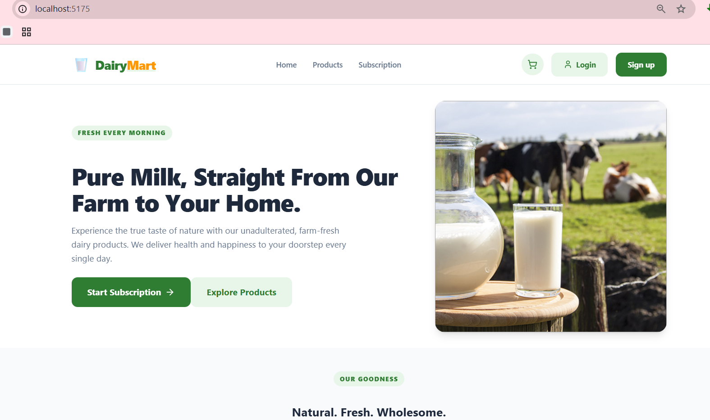
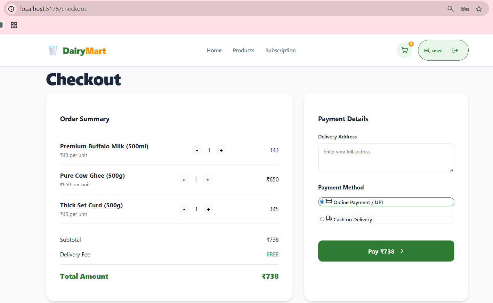

# 🥛 DairyMart: Freshness Delivered to Your Doorstep

[](https://dairymart.duckdns.org)

Welcome to **DairyMart**! This project is all about bringing the farm-fresh experience right to your kitchen. We’ve built a simple, beautiful, and reliable way for families to get their daily dose of pure milk, ghee, and more without any hassle.

Whether you're looking for a one-time purchase or a recurring subscription that "just works" every morning, DairyMart has you covered.

---

## � Deployment & Infrastructure

The project is hosted on a cloud environment with the following stack:

```text
Cloud VM
 └── Ubuntu 24.04
      ├── Nginx (Reverse Proxy)
      ├── Gunicorn (WSGI Server)
      ├── Django + DRF (Backend)
      ├── React + Vite (Frontend)
      ├── SQLite DB (Database)
      ├── Certbot SSL (Security)
      └── GitHub Actions (CI/CD)
```

**Live Website**: [https://dairymart.duckdns.org](https://dairymart.duckdns.org)

---

## �🌟 Features & Highlights

*   **📱 Fully Responsive**: Optimized for all devices—from desktop monitors to mobile screens.
*   **🛒 Persistent Cart**: Your cart items are saved per user, so you can pick up where you left off.
*   **🔒 Auth-Protected Actions**: Adding to cart and checkout require a quick login to keep your orders secure.
*   **⚡ Modern Backend**: Powered by Django Generic API Views for a clean, standardized RESTful experience.
*   **🎨 Premium UI**: Smooth animations with Lucide icons and a modern, clean design.
*   **👨‍💼 Admin Dashboard**: Dedicated portal for staff to manage products, categories, and subscriptions.

---

## 🛠️ Tech Stack

*   **Frontend**: [React](https://reactjs.org/) (Vite), [Lucide Icons](https://lucide.dev/), CSS3 (Flexbox/Grid/Animations)
*   **Backend**: [Django](https://www.djangoproject.com/), [Django REST Framework](https://www.django-rest-framework.org/) (Generic Views)
*   **Database**: SQLite (Development)
*   **Auth**: Simple JWT / Session based patterns

---

## 🚀 Getting Started

### 1. Prerequisites
- Python 3.10+
- Node.js 18+

### 2. Backend Setup (The Brain)
```bash
cd backend
# Create and activate virtual environment
python -m venv venv
.\venv\Scripts\Activate.ps1  # Windows
# source venv/bin/activate   # Linux/macOS

# Install dependencies
pip install -r requirements.txt

# Run migrations and start server
python manage.py migrate
python manage.py runserver 7500
```

### 3. Frontend Setup (The Beauty)
```bash
cd frontend
npm install

# Start Main Website (Port 3000)
npm run dev

# Start Admin Dashboard (Port 3001)
npm run admin
```

---

## 📂 Project Structure

```text
├── backend/                # Django REST API (Port 7500)
│   ├── DairyMart/          # Core project settings
│   ├── category/           # Category management
│   ├── customer/           # Customer auth & profiles
│   ├── product/            # Products (CRUD), Cart & Orders
│   ├── staff/              # Staff management & portal
│   └── subscription/       # Subscription plans
├── frontend/               # React (Vite) Application
│   ├── src/
│   │   ├── components/     # Shared UI components
│   │   ├── context/        # Auth & Cart State management
│   │   └── pages/          # Application views (Port 3000: Main, Port 3001: Admin)
└── screenshots/            # Project previews
```

---

## 🧪 API Testing

A Postman Collection (`milkman_collection.json`) is included in the root directory for quick API testing. All endpoints follow standard REST patterns (GET, POST, PUT, DELETE).

---

## 📸 Screenshots

<p align="center">
  
  
</p>
<p align="center">
  
  
</p>

---


